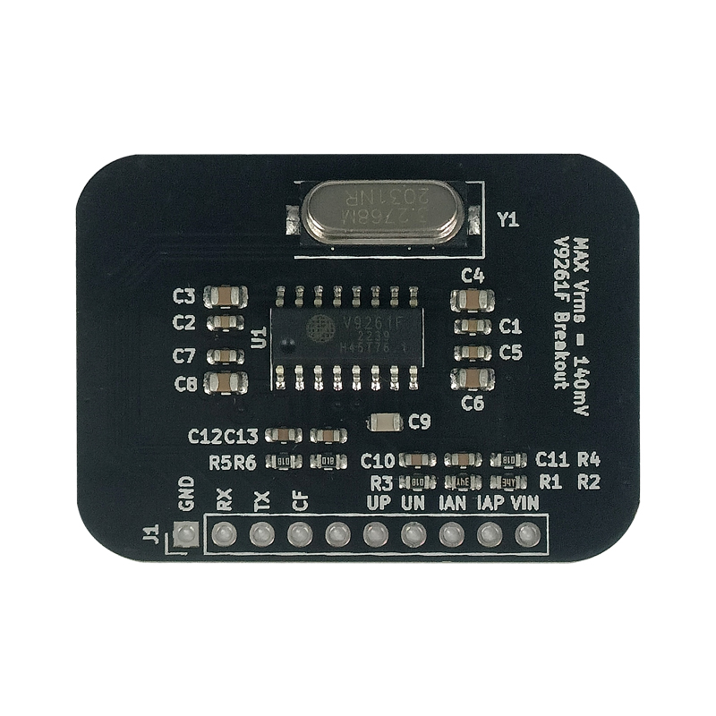
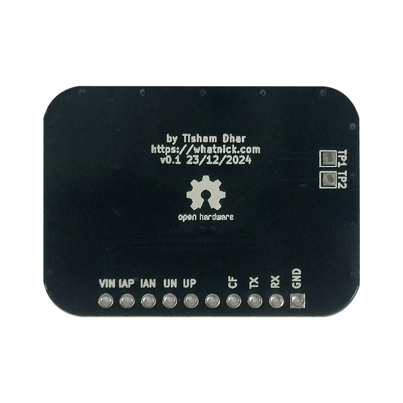

# V9261F Breakout

This is a breakout to evaluate the [V9261F](https://www.vangotech.com/en/pd.php?id=14&types=2) Energy Monitor ASIC from Vangotech and use it with Current clamps and
AC Transformer as current and voltage sampling source respectively. The reference design is borrowed from datasheets
and [Tinkerman Blog](https://tinkerman.cat/post/connected-power-meter).

The Assembled PCB is available via [Elecrow](https://www.elecrow.com/v9261f-breakout.html).

## Assembled PCB

**TOP**

**BOTTOM**

